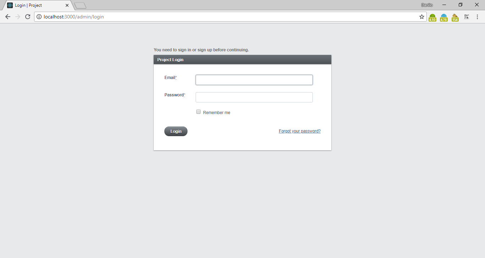
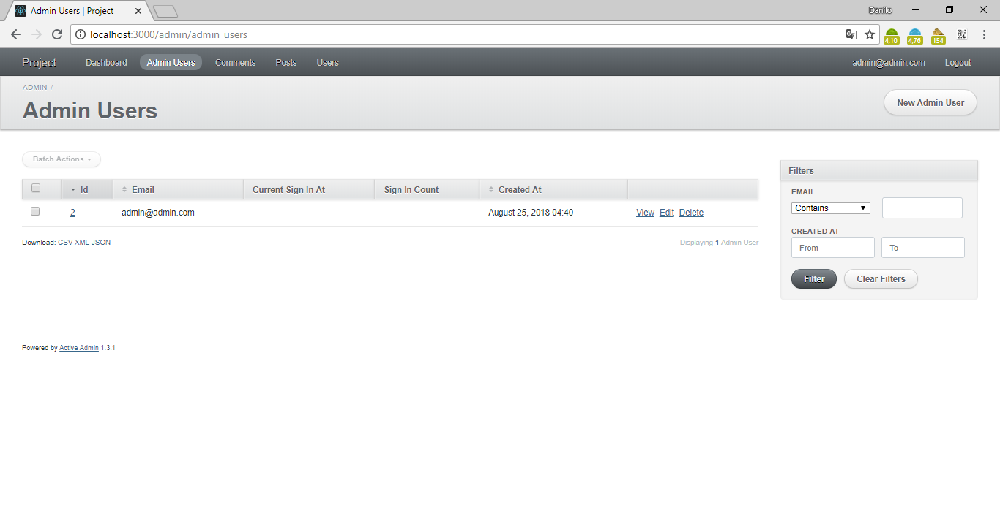
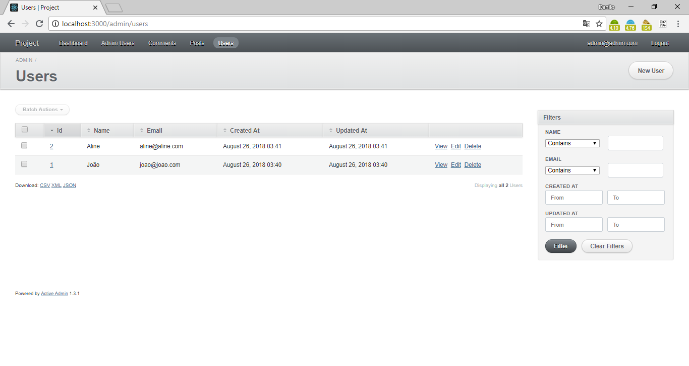
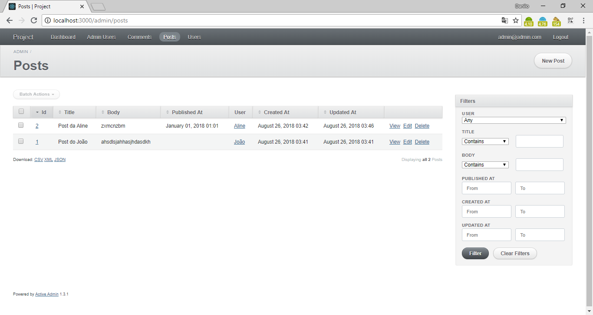
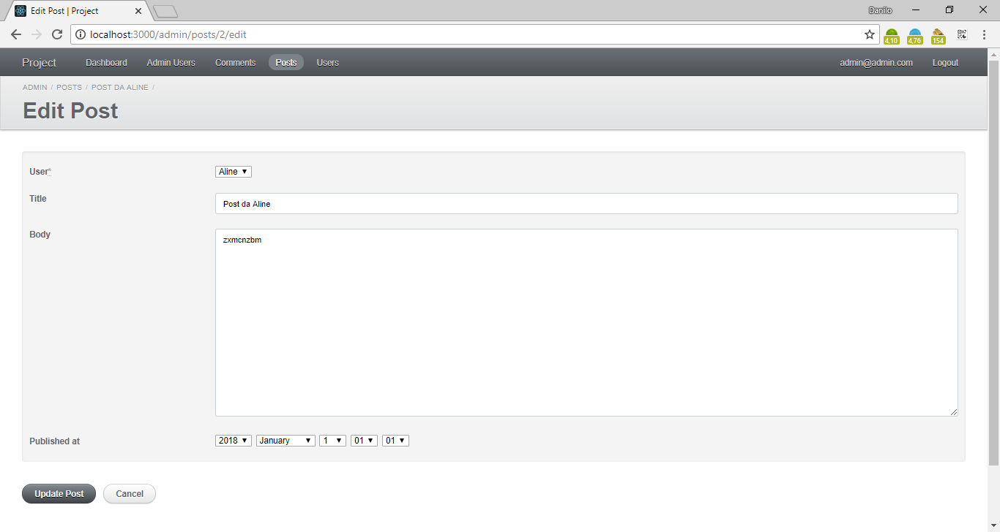

# Posts

Project of an Posts developed with Rails ActiveAdmin.

## Features

- CRUD
- MVC
- Active Record
- Filters
- Sort Column
- Paginate
- Export file (CSV, XML, JSON)
- Routes
- Migrate

## Requirements

- Ruby >= 2.3.3
- Rails >= 5.1.6
- Gem >= 2.5.2

## Tecnologies

- Ruby
- Rails
- CSS and SCSS
- JS
- Bootstrap
- SQLite

## Installation

```
$ git clone https://github.com/danilomeneghel/rails_activeadmin.git

$ cd rails_activeadmin
$ rake db:migrate
$ rake db:seed
```

After everything is done, run the project:

```
$ rails server
```

Finally open http://localhost:3000/admin/ in your browser.

## Routes

http://localhost:3000/rails/info/routes

## Connection

To be able to connect, I advise you to create an account on the panel.

- You can use the default: 
	- User: admin@example.com
	- Password: password

## License

This project is licensed under <a href="LICENSE">The MIT License (MIT)</a>.

## Screenshots

<br><br>
<br><br>
<br><br>
<br><br>
<br><br>
